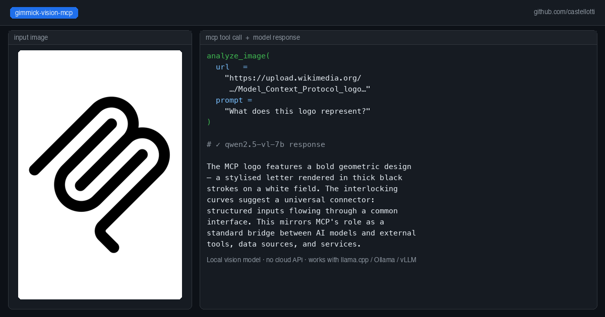

# gimmick-vision-mcp

An MCP server that bridges Claude Code and other agents to any local OpenAI-compatible vision model.

Pass an image URL and a prompt — gimmick-vision forwards the request to your local vision server and returns the text response. Works with any model served via an OpenAI-compatible API (llama.cpp, Ollama, vLLM, etc.).




## Why this exists

Claude Code (especially when running against a local LLM like Qwen3-Coder-Next) has no built-in vision capability. `gimmick-vision` adds three image analysis tools to the MCP toolset, routing vision requests to a separate local model — for example Qwen2.5-VL-7B — without any cloud API calls.

## Tools provided

| Tool | Description |
|------|-------------|
| `analyze_image` | Analyze a single image from a URL. Returns a description or answer to the prompt. |
| `compare_images` | Send up to 8 images for combined analysis or comparison. |
| `read_image_text` | OCR-focused extraction of all visible text from an image. |

## Quick start with Docker

```bash
docker run --rm -i \
  -e VISION_API_BASE=http://host.docker.internal:8081/v1 \
  -e VISION_MODEL=qwen2.5-vl-7b \
  gimmick-vision-mcp:latest
```

Add to your `.mcp.json`:

```json
{
  "mcpServers": {
    "gimmick-vision": {
      "command": "docker",
      "args": [
        "run", "--rm", "-i",
        "-e", "VISION_API_BASE=http://host.docker.internal:8081/v1",
        "-e", "VISION_MODEL=qwen2.5-vl-7b",
        "gimmick-vision-mcp:latest"
      ]
    }
  }
}
```

## Building the Docker image

```bash
git clone https://github.com/castellotti/gimmick-vision-mcp
cd gimmick-vision-mcp
docker build -t gimmick-vision-mcp:latest .
```

## Building locally

```bash
npm install
npm run build
node build/index.js
```

## Environment variables

| Variable | Default | Description |
|----------|---------|-------------|
| `VISION_API_BASE` | `http://host.docker.internal:8081/v1` | Base URL of the vision API server |
| `VISION_MODEL` | `qwen2.5-vl-7b` | Model alias sent in API requests |
| `VISION_TIMEOUT` | `60000` | Request timeout in milliseconds |
| `GIMMICK_PANEL_URL` | `http://host.docker.internal:6081/api/vision` | Optional: push results to a gimmick-search control panel for live preview |

## Running a local vision server

Any OpenAI-compatible server that accepts `image_url` in chat completions works. Example with llama.cpp:

```bash
llama-server \
  -m Qwen2.5-VL-7B-Instruct-Q4_K_M.gguf \
  --mmproj mmproj-Qwen2.5-VL-7B-Instruct-Q8_0.gguf \
  --port 8081 \
  --host 0.0.0.0 \
  -ngl 999
```

On macOS/Metal, full GPU offload (`-ngl 999`) works well. On CUDA machines where the primary LLM already fills VRAM, run the vision model on CPU (`-ngl 0`).

## Integration with gimmick-search

If you use [gimmick-search-mcp](https://github.com/castellotti/gimmick-search-mcp), gimmick-vision can push analysis results to its control panel sidebar. Set `GIMMICK_PANEL_URL` (the default points to the gimmick-search control panel on port 6081). Failures are silently ignored so the tool works standalone.

## License

MIT
